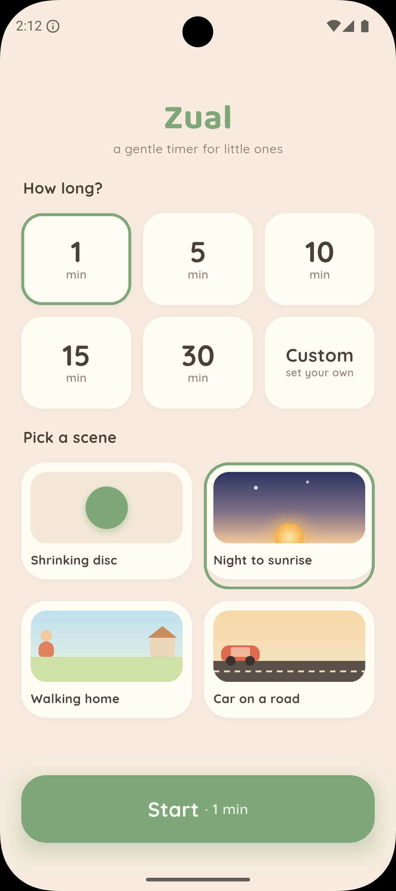
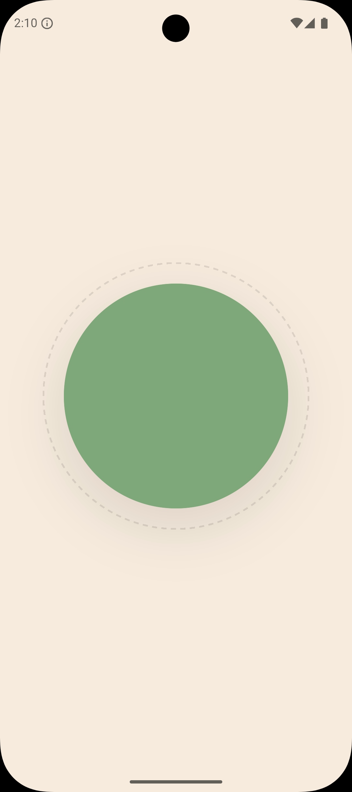
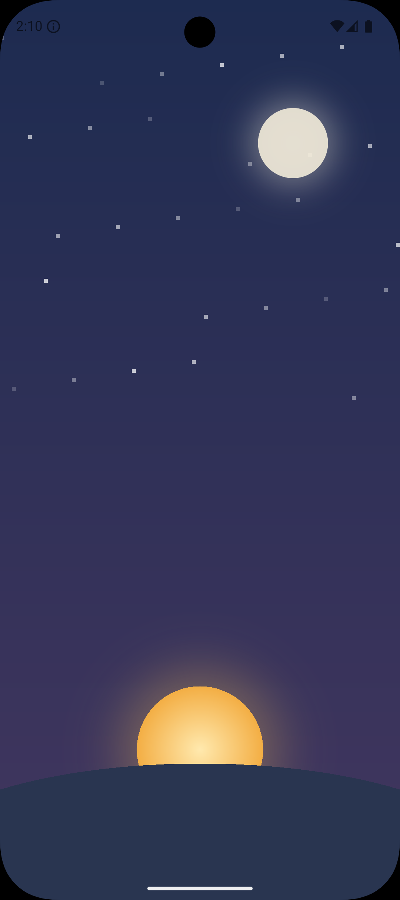
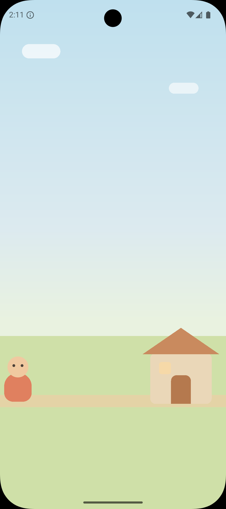
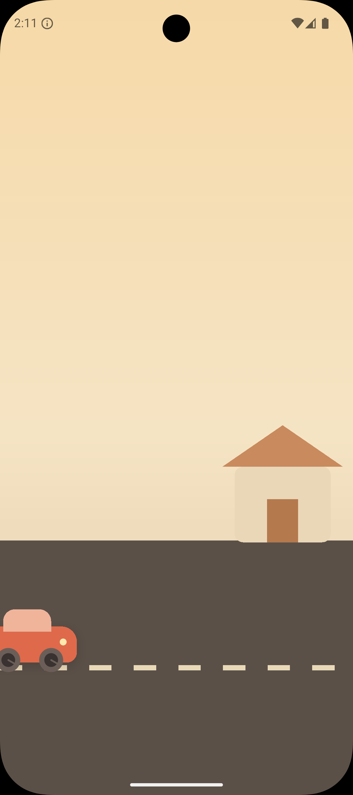

# Zual

**A gentle visual countdown timer for little ones.**

Zual is a wordless, number-free countdown timer for children roughly ages 2–6 — kids who
don't yet understand what "ten more minutes" means. A parent sets a duration and picks a
scene; the child watches a full-screen animation that makes the time remaining readable at
a glance from across a room. When time is up, a soft two-tone chime plays and the scene
settles into a calm finished state.

It is deliberately *not* a productivity tool. No streaks, no alarms, no celebration
fanfare — playful but calm, meant to sit on a kitchen counter or a bedroom shelf.

**Core idea:** a child with no concept of clock time can look at the screen from across the
room and understand, without any numbers or words, roughly how much longer they have to
wait.

---

## The scenes

Four visualizations, each a pure function of elapsed time. Nothing in a running scene is
tappable — the child cannot break it.

| Scene | What the child sees |
| --- | --- |
| **Shrinking disc** | A disc that shrinks as time passes, cycling green → yellow → red |
| **Night to sunrise** | A night sky that brightens into dawn; stars and moon fade, the sun rises |
| **Walking home** | A character walking a path toward a house, arriving at time-up |
| **Car on a road** | A car driving toward its destination, wheels visibly spinning |

<p>
  
  
  
  
  
</p>

## How a session goes

1. **Setup (parent-facing).** Pick a duration — presets of 1 / 5 / 10 / 15 / 30 minutes, or
   a Custom stepper covering 1–120 minutes — then pick a scene and press Start. The last
   used preset and scene are remembered for next launch.
2. **Running (child-facing).** Full-screen portrait, zero text, zero numbers, nothing
   tappable. The screen stays awake for the duration.
3. **Parent controls.** A silent ~850 ms long-press anywhere on the running screen opens a
   blurred bottom sheet with Pause/Resume, End timer, a mute toggle, and Keep watching.
   Deliberately undiscoverable to a child.
4. **Done.** The chime plays once, the scene settles into its end state, and a slowly
   breathing "All done" pill is the only thing that responds to a tap — returning to Setup.

The countdown is driven by wall-clock timestamps rather than a tick counter, so it keeps
advancing — and still reaches "done" — while the app is backgrounded or the device is
asleep.

## Status

v1.0 is complete and release-ready: signed app bundle, adaptive launcher icon, store
listing assets, and a privacy policy. Publication to Google Play is the remaining manual
step. See `.planning/PROJECT.md` for the requirement-by-requirement record.

- **Platform:** Android only for v1. The repo also carries the Flutter web scaffold, but
  web is not a supported target for this milestone, and there is no `ios/` directory.
- **Privacy:** no accounts, no analytics, no ads, no network calls. Fully offline. Policy
  text lives in `docs/index.html`.

## Getting started

Requires the Flutter SDK with a Dart SDK matching `^3.10.7` (developed and verified against
Flutter 3.44.5 / Dart 3.12.2), plus the Android SDK and a device or emulator.

```bash
flutter pub get
flutter run                  # debug build on a connected Android device
flutter test                 # 134 tests
flutter analyze              # flutter_lints 6.0.0, expected clean
```

### Release builds

Release signing config is intentionally **not** committed. `android/key.properties` and
`android/upload-keystore.jks` are gitignored, so a fresh clone can build debug but not
release until you supply your own. Create `android/key.properties` with `storeFile`,
`storePassword`, `keyAlias`, and `keyPassword`, then:

```bash
flutter build appbundle --release   # build/app/outputs/bundle/release/app-release.aab
```

The Android application ID is `com.ireiter.zual`; the app version lives in `pubspec.yaml`
(`1.0.0+1`).

### Regenerating store assets

The launcher icon, the 512×512 store icon, and the 1024×500 Play Store feature graphic are
all rendered headlessly from the app's own `CustomPainter`s rather than drawn by hand — so
the store artwork can never drift from the shipping visuals.

```bash
dart run flutter_launcher_icons                      # adaptive launcher icon mipmap set
flutter test test/tool/generate_feature_graphic.dart # store_assets/feature_graphic.png
```

The generators need the Flutter test engine (`dart:ui` rasterization has no headless
backend outside it), which is why they live under `test/tool/` and run via `flutter test`
rather than `dart run`. `generate_launcher_icon_test.dart` writes the icon layers into
`assets/icon/`, which `dart run flutter_launcher_icons` then expands into the Android
mipmap set.

`generate_feature_graphic.dart` is deliberately named without the `_test.dart` suffix so a
plain `flutter test` never picks it up. The two icon generators *are* `_test.dart` files, so
they do rewrite their committed PNGs on every `flutter test` run — known tech debt. Output
is byte-stable, so this normally leaves the working tree clean.

## Repo layout

| Path | Contents |
| --- | --- |
| `lib/timer/` | `TimerController` (the wall-clock progress engine), `TimerPhase`, lifecycle binding, screen-wake |
| `lib/scenes/` | `SceneRenderer` contract, `SceneTheme` enum, the registry, and one folder per scene (`disc/ sunrise/ walk/ car/`), each a scene widget plus its `CustomPainter` |
| `lib/screens/` | `SetupScreen` (parent) and `RunningScreen` (child) |
| `lib/widgets/` | Shared UI: `SceneGrid`/`SceneCard`, `PressableSurface`, `HoldRepeatButton` |
| `lib/theme/` | `AppTokens` — every color, radius, shadow, and text style in one place |
| `lib/audio/` | Pure-Dart WAV chime synthesis plus the player interface and its `audioplayers` adapter |
| `lib/settings/` | `SetupPreferences` — validated `shared_preferences` persistence |
| `test/` | Mirrors `lib/`; `test/tool/` holds the headless asset generators |
| `design/` | Design source of truth: `design/README.md` plus two HTML prototypes |
| `assets/` | Bundled Baloo 2 / Quicksand font instances and launcher icon layers |
| `screenshots/`, `store_assets/` | Play Store listing artwork |
| `docs/` | The privacy policy page |
| `.planning/` | GSD planning artifacts — project state, roadmap, phase history, decisions |

## How it works

**Wall-clock timer.** `TimerController` is a `ChangeNotifier` that derives normalized
progress from real timestamps (`DateTime.now()` deltas), not from a `Stopwatch` or a tick
count. Android throttles or suspends timers for backgrounded apps, so anything tick-based
would silently fall behind; deriving from timestamps means a 20-minute timer is still
correct after 20 minutes in someone's pocket. Progress is held to a monotonic high-water
mark so a backward device-clock change cannot rewind a running countdown. A single
`syncToWallClock()` reconcile path serves both the periodic ticker and the
foreground-return lifecycle hook.

**Scenes are painters, not assets.** There are no bitmaps anywhere in the running UI —
every scene is drawn with `CustomPainter` from shape primitives. All four share one
`SceneRenderer` / per-scene `Ticker` contract: each painter is a pure function of
`TimerController.progress` plus a local decorative-loop phase, so scenes stay swappable and
there is exactly one animation spine to reason about. `sceneFor()` is the only place
allowed to name a concrete scene widget by type.

**Plugin isolation.** Each platform plugin sits behind a plain Dart interface with a real
adapter and a no-op test double — `ScreenWake` / `WakelockScreenWake`, `ChimePlayer` /
`AudioplayersChimePlayer` / `NoopChimePlayer`. Exactly one file per feature imports the
plugin, so widget tests never touch a platform channel.

**Untrusted persistence.** `SetupPreferences` re-validates on every read: durations are
clamped to 1–120, the stored theme name is resolved with a fallback, and even a wrong-typed
stored value falls back to defaults rather than crashing launch.

**Design fidelity.** Colors, radii, typography, shadows, easing curves, and interaction
thresholds come from `design/README.md` and are treated as final rather than as starting
points. They are centralized in `lib/theme/app_tokens.dart`.

## Design and planning docs

- `design/README.md` — the design spec: full token palette, typography, timings.
- `design/Zual.dc.html` — the interactive high-fidelity prototype.
- `.planning/PROJECT.md` — requirements, constraints, and the full decision log.
- `.planning/RETROSPECTIVE.md` — v1.0 lessons learned.
- `.planning/codebase/` — architecture, stack, conventions, and testing notes.

## License

No license file is present, so this repository is "all rights reserved" by default. Add a
`LICENSE` before sharing or accepting contributions.
